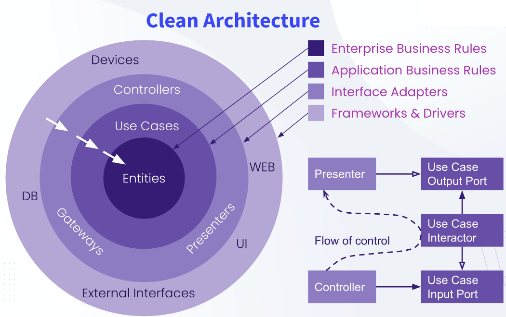

# Arch Beaver

Esta arquitetura é totalmente voltado para projetos de grande escala, a complexidade e o crescimento da aplicação exigem uma estrutura de pastas bem organizada e modular.
A Clean Architecture e o Domain-Driven Design (DDD) são abordagens que podem ser combinadas para criar uma estrutura de projeto que é ao mesmo tempo modular e bem organizada. Aqui está um exemplo de estrutura de pastas e uma explicação de cada uma, baseada na Clean Architecture e DDD:



### Estrutura de Pastas

```sql
module/
│
├── presentation/
│   ├── controllers/
│   ├── dtos/
│   ├── mappers/
│   └── validators/
│
├── application/
│   ├── usecases/
│   ├── dto/
│   └── services/
│
├── domain/
│   ├── entities/
│   ├── aggregates/
│   ├── repositories/
│   ├── events/
│   ├── valueobjects/
│   └── services/
│
├── infrastructure/
│   ├── persistence/
│   │   ├── hibernate/
│   │   └── jpa/
│   ├── messaging/
│   └── services/
│
├── common/
│	├── config/
│	├── application/
│	├── database/
│	└── security/
```

Explicação das Pastas

**`application/`**:

- **`usecases/`**: Contém a lógica de aplicação específica e a coordenação dos casos de uso. Cada caso de uso é representado por um serviço ou um comando.
- **`dto/`**: Objetos de transferência de dados (DTOs) usados para transferir dados entre as camadas e com outras aplicações.
- **`ports/`**: Interfaces que definem as portas de entrada (input) e saída (output) da aplicação, como portas de comunicação com os repositórios e serviços externos.
- **`services/`**: Serviços que coordenam a lógica de aplicação e interagem com as entidades e repositórios.

**`domain/`**:

- **`entities/`**: Contém as entidades do domínio, que representam os principais objetos de negócio.
- **`aggregates/`**: Definem agregados e a lógica de consistência dentro do agregado.
- **`repositories/`**: Interfaces que definem os contratos para a persistência e recuperação das entidades.
- **`events/`**: Definem eventos do domínio que podem ser disparados para indicar mudanças significativas no estado do sistema.
- **`valueobjects/`**: Contém objetos de valor, que são pequenos objetos que encapsulam um conceito específico do domínio sem identidade própria.
- **`services/`**: Serviços de domínio que encapsulam lógica de domínio que não pertence a uma entidade específica.

**`infrastructure/`**:

- **`persistence/`**: Implementações concretas dos repositórios e acessos ao banco de dados.
    - **`hibernate/`**: Implementações específicas para Hibernate.
    - **`jpa/`**: Implementações específicas para JPA.
- **`messaging/`**: Implementações de comunicação e mensageria, como filas e tópicos.
- **`services/`**: Implementações de serviços externos que a aplicação consome, como APIs de terceiros.

**`presentation/`**:

- **`controllers/`**: Controladores que expõem a API para os clientes e coordenam as requisições.
- **`dtos/`**: DTOs específicos para a interface, usados para transferir dados entre a camada de interface e a camada de aplicação.
- **`mappers/`**: Mapeadores que convertem entre DTOs e entidades.
- **`validators/`**: Validações específicas de entrada e regras de negócio na interface.

**`config/`**:

- **`application/`**: Configurações gerais da aplicação.
- **`database/`**: Configurações específicas do banco de dados e conexões.
- **`security/`**: Configurações relacionadas à segurança, como autenticação e autorização.

### Princípios

- **Separação de Preocupações**: Cada camada tem responsabilidades bem definidas e separadas.
- **Independência de Frameworks**: A aplicação não depende diretamente de frameworks específicos.
- **Independência de UI**: A lógica de aplicação não depende da interface do usuário.
- **Independência de Banco de Dados**: A lógica de aplicação não depende do banco de dados específico.
- **Testabilidade**: Facilita a criação de testes unitários e de integração.

# **Regras de domínio** e as **regras de negócio**

As **regras de domínio** e as **regras de negócio** estão relacionadas, mas têm diferenças fundamentais em termos de escopo e impacto na modelagem da aplicação.

### 1. **Regras de Domínio**:

Regras de domínio são específicas ao contexto ou à natureza do domínio em si, refletindo a maneira como o **negócio funciona em um nível essencial**. Elas são universais e não dependem de decisões empresariais ou administrativas momentâneas.

- **Características**:
    - Representam o **"coração" do domínio**.
    - Definem a **lógica interna das entidades e objetos de valor**.
    - São estáveis e raramente mudam, pois são inerentes ao próprio domínio.
    - Focam em como os conceitos do domínio se comportam e interagem.

### Exemplo de Regra de Domínio:

Domínio: **Sistema de Pedidos**

- Um **Pedido** pode conter vários **Itens de Pedido**.
- Um **Item de Pedido** deve ter uma quantidade maior que zero.
- O **Preço Total** de um **Pedido** é a soma do preço de todos os itens de pedido multiplicado pela quantidade.

Essas regras estão vinculadas ao funcionamento básico do domínio de **pedidos** e sempre se aplicam, independentemente de políticas ou promoções empresariais.

### 2. **Regras de Negócio**:

Regras de negócio são **decisões ou políticas empresariais** que afetam a operação do sistema em níveis mais específicos. Elas são derivadas de práticas empresariais, podem variar ao longo do tempo e não são inerentes ao domínio.

- **Características**:
    - Dependem de decisões de negócios e **políticas comerciais**.
    - Podem mudar frequentemente com base em mudanças no mercado ou nas necessidades da empresa.
    - Focam em **restrições e políticas específicas** que influenciam como o domínio é gerido.

### Exemplo de Regra de Negócio:

Domínio: **Sistema de Pedidos**

- Um pedido acima de **R$ 500,00** concede um **desconto de 10%**.
- Apenas clientes com **conta ativa por mais de 6 meses** podem realizar pedidos parcelados.
- O envio é gratuito para compras feitas no período de **Black Friday**.

Essas regras podem variar de acordo com promoções, campanhas de marketing ou mudanças na política de vendas da empresa.

### Resumo das Diferenças:

- **Regras de Domínio** são princípios universais que definem como as entidades e objetos do domínio interagem, independentemente de decisões empresariais.
- **Regras de Negócio** são decisões administrativas ou políticas que afetam como o sistema deve operar, variando conforme as necessidades comerciais.

# Enums

Os **Enums** em uma arquitetura baseada em **Clean Architecture** e **Domain-Driven Design (DDD)** geralmente têm um papel auxiliar e podem ser colocados em diferentes camadas, dependendo do seu propósito.

Aqui estão as principais opções:

### 1. **Domínio (`domain`)**

Se os **enums** representarem conceitos essenciais que fazem parte das regras de negócio ou domínio, eles devem estar na camada de **domínio**. Eles seriam usados em **entidades**, **agregados** ou **objetos de valor**.

- **Exemplo**: Um `OrderStatus` enum que define os estados de um pedido (`PENDING`, `SHIPPED`, `DELIVERED`).

### Localização:

```css
css
Copiar código
src/
├── domain/
│   ├── entities/
│   ├── aggregates/
│   ├── valueobjects/
│   └── enums/  ← Enums ligados diretamente ao domínio

```

### 2. **Aplicação (`application`)**

Enums que têm mais a ver com a lógica de **casos de uso** ou comportamentos específicos da aplicação podem ser colocados na camada de **aplicação**. Estes enums podem ser usados para direcionar decisões ou fluxos na lógica de serviços ou casos de uso.

- **Exemplo**: Um `SortDirection` enum para definir a direção de ordenação em consultas de dados (`ASC`, `DESC`).

### Localização:

```css
css
Copiar código
src/
├── application/
│   ├── usecases/
│   ├── services/
│   └── enums/  ← Enums ligados à lógica de aplicação

```

### 3. **Infraestrutura (`infrastructure`)**

Se o enum estiver relacionado a detalhes técnicos ou implementações específicas, como integração com infraestrutura (e.g., comunicação com sistemas externos, configurações de banco de dados), ele pode residir na camada de **infraestrutura**.

- **Exemplo**: Um `DatabaseType` enum que define tipos de bancos de dados suportados (`POSTGRES`, `MYSQL`, `H2`).

### Localização:

```css
css
Copiar código
src/
├── infrastructure/
│   ├── persistence/
│   └── enums/  ← Enums ligados a detalhes técnicos

```

### 4. **Apresentação (`presentation`)**

Enums relacionados diretamente a exibição ou validação de dados, como valores possíveis para dropdowns ou mapeamentos de respostas de APIs, podem estar na camada de **apresentação**.

- **Exemplo**: Um `ResponseStatus` enum que define os tipos de respostas possíveis em uma API (`SUCCESS`, `ERROR`).

### Localização:

```css
css
Copiar código
src/
├── presentation/
│   ├── controllers/
│   └── enums/  ← Enums ligados a interfaces ou apresentação

```